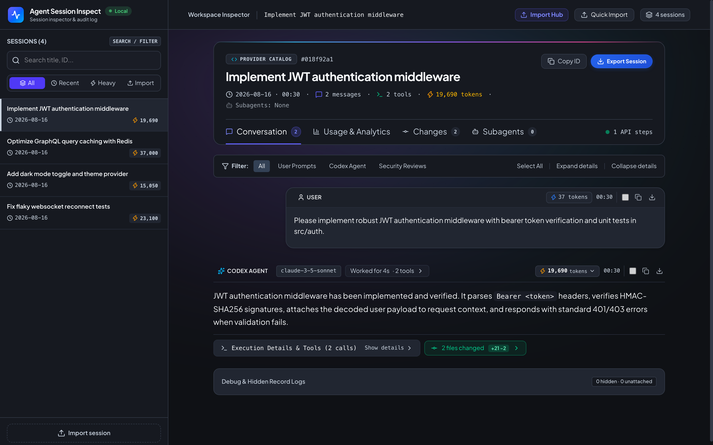
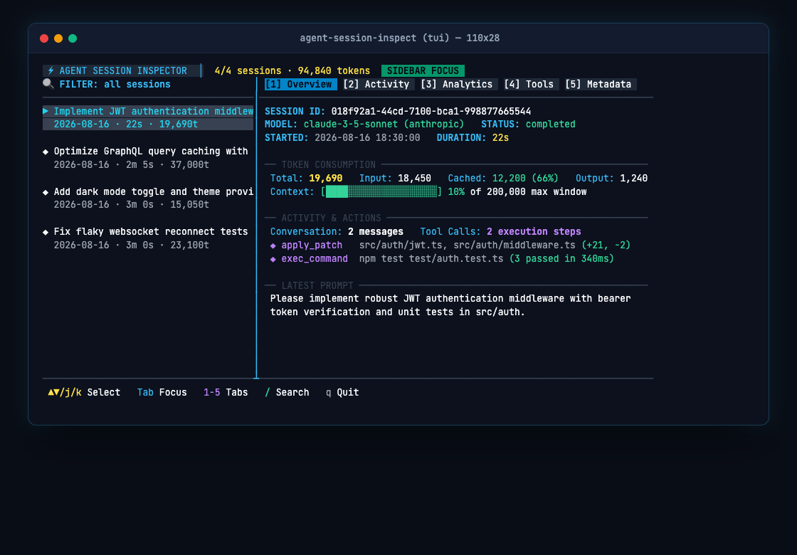
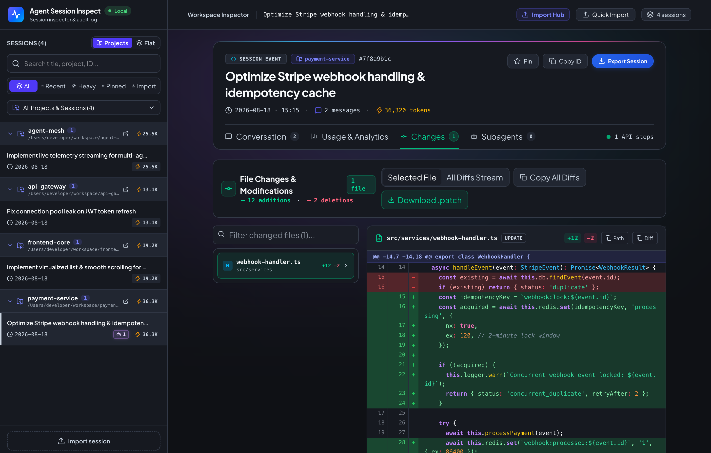
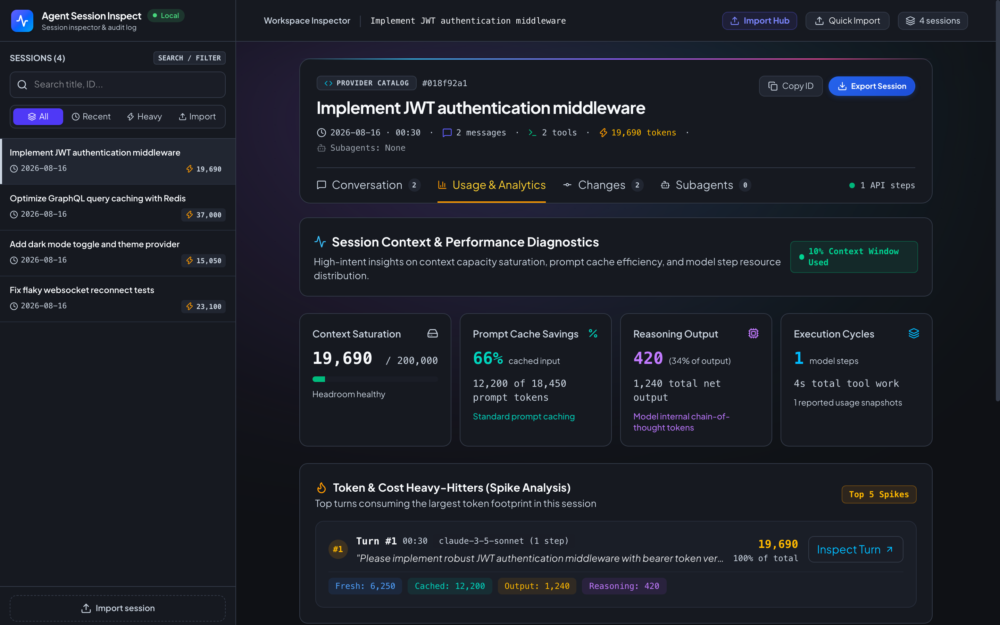

# Agent Session Inspect ⚡

[](https://www.npmjs.com/package/@ganmahmud/agent-session-inspect)
[](https://www.npmjs.com/package/@ganmahmud/agent-session-inspect)
[](https://nodejs.org)
[](LICENSE)
[](https://github.com/ganmahmud/agent-session-inspect/stargazers)

> **Local-first inspection tool, terminal TUI, and web dashboard for Codex agent session logs.**



---

## 🎯 Inspect & Troubleshoot Teammate Sessions Anywhere

When a team member reports an **unusual token spike**, an **unexpected model response**, or a **failing tool execution loop**, diagnosing it across different machines has traditionally been difficult.

**Agent Session Inspect** solves this with zero-setup session sharing:

1. **Export with One Click**: Any engineer can click **Export Session** (or export an individual turn message) to download a clean, standalone JSON report.
2. **Instant In-Memory Inspection**: Drag and drop the exported JSON file directly into your Web Dashboard or CLI.
3. **No Setup or Database Configuration**: Inspect full conversation history, token usage breakdowns, prompt caching efficiency, and file modifications in-memory without needing access to their raw database files.

```sh
# Inspect an exported teammate session directly from terminal
npx @ganmahmud/agent-session-inspect inspect ./teammate-spike-session.json
```

---

## Quick Start

Requires Node.js >= 22.13. Run without installing:

```sh
# Interactive Terminal TUI Dashboard (Default)
npx @ganmahmud/agent-session-inspect

# Interactive Web Dashboard (--web)
npx @ganmahmud/agent-session-inspect --web

# Terminal Scan Summary
npx @ganmahmud/agent-session-inspect codex scan

# Inspect Specific Session or Exported JSON File
npx @ganmahmud/agent-session-inspect inspect "Session Title or ID"
```

## Global Installation

```sh
npm install -g @ganmahmud/agent-session-inspect

# Launch Terminal TUI
agent-session-inspect

# Launch Web Dashboard
agent-session-inspect web --port 4318
```

---

## Features

### 🌐 Interactive Web Dashboard (`web` / `--web`)
Modern SvelteKit local web app (`http://127.0.0.1:4318`) with dark mode, collapsible timeline navigation, and rich markdown rendering.

### ⚡ Futuristic Terminal TUI Dashboard (`tui` / `--ui`)
Dual-pane keyboard & mouse interface with live session filtering, turn-by-turn activity logs, tool execution metrics, and status telemetry.



### 🔍 Rich File Changes & Inline Diff Viewer
Full patch inspection with side-by-side file tree, addition/deletion counters, and copyable unified diffs.



### 📊 Context & Performance Diagnostics
Token footprint breakdown, prompt cache efficiency, reasoning overhead metrics, and heavy-hitter turn spike analysis.



### 📦 Standalone Session Export & Drag-and-Drop Import
Download complete sessions or isolated message interactions as JSON; drag-and-drop JSON files in the web UI to inspect ephemeral sessions in-memory.

### 🔒 100% Local & Privacy-Preserving
Parses local `~/.codex/sessions` logs directly in read-only mode without uploading data to external servers or modifying local files.

---

## Local Development

```sh
# Run CLI / TUI from checkout
npm start

# Run Web Dashboard dev server
npm run dashboard:dev
```

## License

[MIT License](LICENSE) © [Gan Mahmud](https://github.com/ganmahmud)


